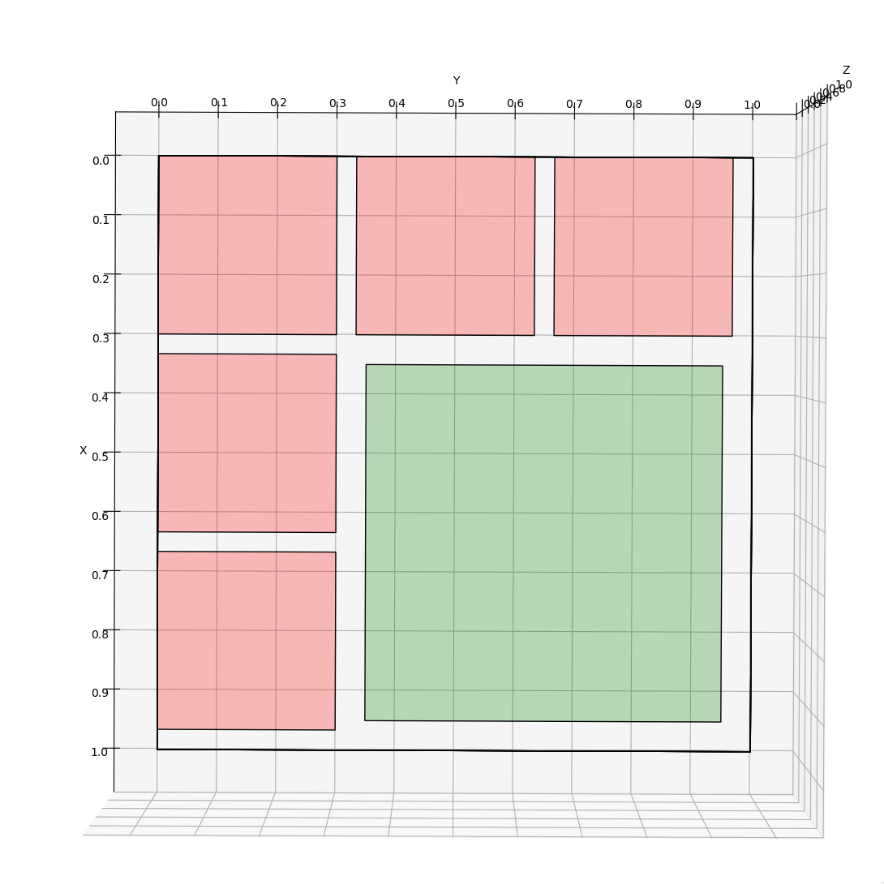
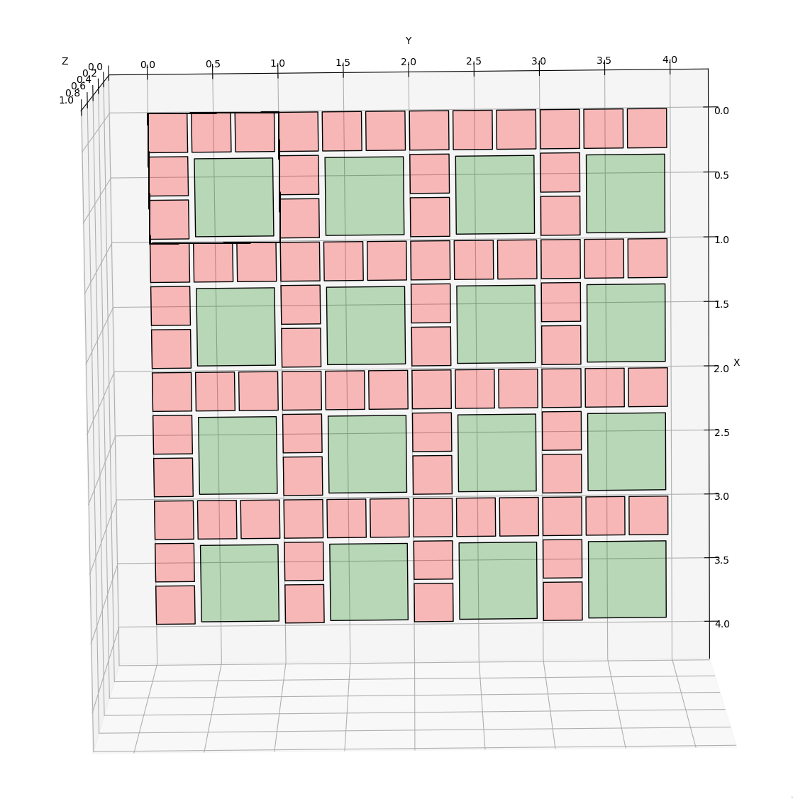
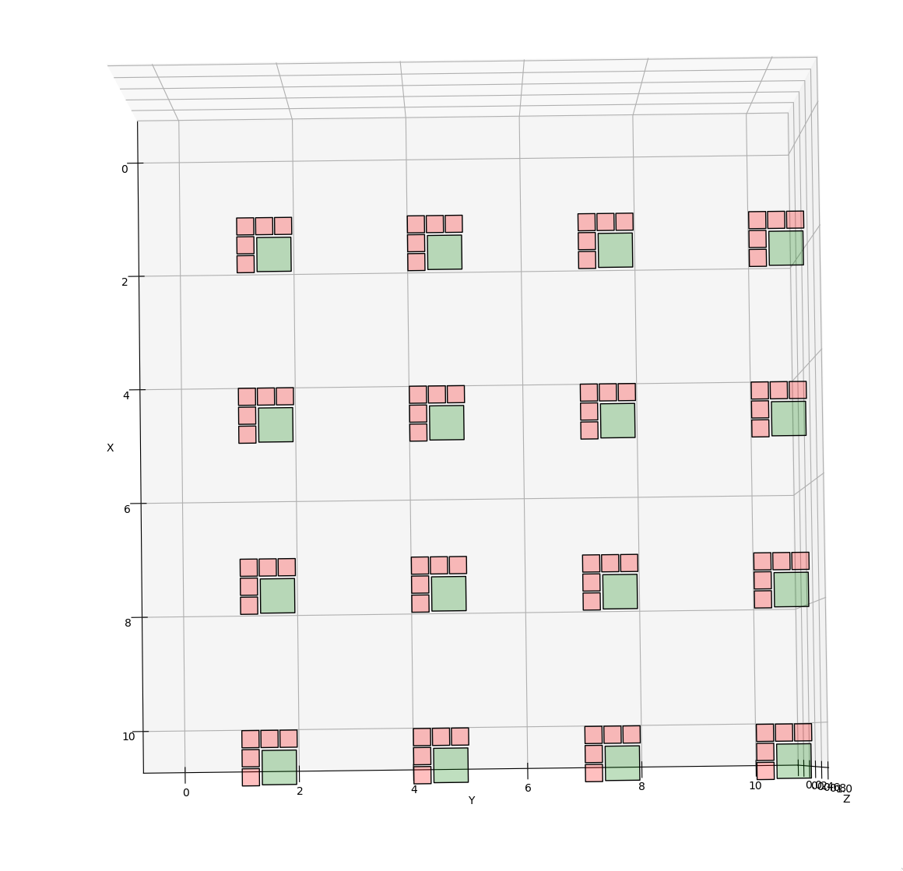

# Installation

The install process should be very straight forward.
It requires a `root` install, tested with `root 6.26/06` but should be also useable with root5.
After cloning the directory, make sure that root is active (`root-config --version`).
If not, source your favourite root build.
Then, in the main folder just run `make`.

Sometimes this process can fail.
The most common cause for this is the existence of older library files (`*.o`), that where compiled with a different root install.
In this case, remove all library files (`yes | rm *.o`) and run `make` again.


- **TL:DR** :  Run `make`.


# Usage

```
./analyze_light <G4_input_file> <SiPM_Placement_File> <Size of PD (cm)> <OutputFile>
```

- `G4_input_file`: Result from the Geant4 simulation (`qpixg4`)
- `SiPM_Placement_File`: Discussed below. Center of each detection element
- `Size of PD`: The full width of a single detection element
- `OutputFile`: Name of the output file

- Optional arguments are:
	- `--number <int>`	 Run over a subset of events (first n) instead of all in the file
	- `--charge <PathToPlacementFile>` Enables the charge simulation including diffusion using the placment file given
	- `--diffusion`	 Disables the diffusion during the drift
	- `--pixSize <double>` Using a specified size for the charge detector pixels. Otherwise the size of the SiPMs are assumed
	- `--exclOut`	 Disables the saving of the G4 input data to the output file

## Output File

The output of the charge and light simulations are stored in the `ScintSim_tree`.
The charge and light objects are of type `vector<vector<double>>`.
The first axis corresponds to PD ID, see below, the second axis runs along the number of detected photons in this PD, and stores the times.
To access the number of photons detected in PD 17, one needs to run

```cpp
total_time_vuv->at(17).size()
```

If one wants to get the hit times of all photons detected on PD 17, you have to

```cpp
for(int photonIt = 0; photonIt < total_time_vuv->at(17).size(); photonIt++){
	time = total_time_vuv->at(17).at(photonIt);
}
```

Same holds for the charge output.
If the option `--charge` is not enabled, it will still produce an output elemnt for it, which will be empty.

There are two TH2Poly's stored in the output file. These store the locations of the SiPM/pixels.
Again, if not run with the `charge` option, this is just an empty TH2Poly for the charge.

- **TL:DR** :  Returns `vector<vector<double>>` of PD-IDs and hit time for each photon/electron
- **A note on the numbering: TH2Poly bin n corresponds to detector bin n-1!**
- Example in `Docs/ExampleMacro`

## Placement Files

The idea of the code is to be able to run light simulations with arbitrarily placed light detectors.
For this, a so called placement file is required.
These placement files give the center coordinates of the placed light detectors.
The size of the detectors are determined in a later stage.
Below an example of such a placement file is presented:


```sh
							0 5.0 5.0 0 1 3
							1 5.0 15.0 0 1 3
							2 5.0 25.0 0 1 3
							3 5.0 35.0 0 1 3
							4 5.0 45.0 0 1 3
							5 5.0 55.0 0 1 3
							6 5.0 65.0 0 1 3
							7 5.0 75.0 0 1 3
							8 5.0 85.0 0 1 3
							9 5.0 95.0 0 1 3
							10 10.0 5.0 0 1 3
							11 10.0 15.0 0 1 3
							12 10.0 25.0 0 1 3
							13 10.0 35.0 0 1 3
							14 10.0 45.0 0 1 3
							15 10.0 55.0 0 1 3
							16 10.0 65.0 0 1 3
							17 10.0 75.0 0 1 3
							18 10.0 85.0 0 1 3
							19 10.0 95.0 0 1 3
```

The first column gives the ID of each detector. These have to be unique.
Next, the `x`, `y` and `z` coordinates are given.
In the case above, we place 20 photo detectors on the `z=0` plane.
The first ten are all placed with the same `x` coordinates and distanced 10 cm in the y-direction.
The last ten are moved 5 cm along the x-axis.
See the example in figure 1.
The units are understood to be in cm.

{width=48%}

The 5th variable is the detector type.
This variable is currently not used.
Its intension is to be able to implement different types of photo detector, meaning non-rectangular ones, i.e. circular PMTs.
The last variable is the direction in which the active surface is pointing.
If the detector sits on the `z=0` plane, it probably faces along the z-axis.
This is noted with the value `3`.
For detectors facing along the `y` axis, this value should be `2`, and for detectors facing along the `x` axis, `1`.

#### Generate for grid layout

To generate these files, a helper script is supplied in `PlacementFiles/generate_detpos.py`.
It generates a grid placement of a given distancing.
Currently the same distancing is assumed for the `x`, `y` and `z` coordinates.
But this can be adjusted easily, when required.
The way to do that would be to implement different distances for each direction.
Currently you comment out the corresponding parts that you don't want any PD placed at.

To then get the placement file you run `python generate_detpos.py > placmenFileName`.
To verify if this placement file you can adjust `1_plot_detector_locations.py` to plot the detectors in a 3D plot.
Things to adjust here are read in placement file in

```py
	with open('../SoLAr_10cm_FieldCage.txt', 'r') as csvfile:
```
and then a little bit below the sizes of the detectors you want to plot.
In the case we want to have $2\cdot 2cm^2$ pixels, the placement file above would produce the example in figure 2.
Then run `python 1_plot_detector_locations.py` and you will see a 3D plot of the placements and sizes of the detector you created.

{width=80%}


#### Generate for SoLAr Tiles

Also here we have a helper script, `PlacementFiles/generate_detpos_SoLAr.py`.
At the top, you determine the size of the Anode/Readout plane and the distance between single tiles.
A tile here is understood to be a $1\times 1$ cm$^2$ assembly of 5 charge pixels and 1 SiPM (see below).


The code returns two files, `SiPM` and `Pixel`.
They store the positions of the SiPM's and Pixel's...

{width=48%}
{width=48%}

There is a know problem to occour if the spacing and sizes are incompatible, that some of the detectors actually lie outside of the actual detection plane. Again, see below.

{width=48%}

It's the users obligation to verify no strange placements.

For smaller files we have the `plot_SoLAr_locations.py` to return a 3D plot to verify.
For larger ones, this is code is to slow.
A 2D version could speed things up - but not implemented yet. (Or move to a proper GUI/C++ version at some point).

## Simulation procedure

### Light

- Based on [this Paper](https://link.springer.com/article/10.1140/epjc/s10052-021-09119-3)
- Removed the visible light and enabled placement of PD on all planes, implemented LArQL model
- Split the total amount of photons produced in an event by the fractional solid angle of each photo-detector element

The idea of the light simulation is to first approximate the photons that arrive in each Photo Detector by its relative solid angle and then correct this approximation for effects like rayleigh scattering.
The geometrical approximation for detector $i$ is then just

\begin{equation}
N_\gamma^{Det} = \Delta E \times S_\gamma(dE, dx, \epsilon) \times \Omega_{i}/4\pi\times exp(-d/\lambda)
\end{equation}

- $\Delta E$ energy deposit
- $S_\gamma$ the light yield function, in our case LArQL
- $Omega/4\pi$ fractional solid angle of the detector i
- $\lambda$ the absorption length (here 20m)

Then a Gaisser-Hillas function is used to correct for the effect of Rayleigh scattering and positional dependences.

{width=48%}

The time is finally constructed using a exponential plus landau function which is randomly sampled.

- Drawbacks: Scales linearly with the number of PD. Results dependend on the parametrisation. This was build for DuNE and SBND, including the wires etc. This means that events which are placed in a smaller Volume (like SoLAr) are affected, if they are not in the center of the detector. Moving them to one side, we accumulate different effects due to asymmetry. For DuNE/SBND these are corrected for, but for SoLAr they wont. Its hard to tell how significant they are. We could rebuild a parametrisation for SoLAr using Danieles G4SOLAr.


### Charge

Similar approach, where the number of electrons are calculated from the hits using LArQQ.
These electrons are assumed to be produced at the hit-point.
Then their starting position is smeared in the x-y plane according to the $D_T$ drift constant, with the drift-time calculated as $t_{drift} = z/v_{drift}$.
Along the z-axis the electrons are smeared with the $D_L$ drift constant in the same manor.
These starting positions are then stored in a vector.
Here we assume that the drift-direction is along the z-axis, and the charge-readout sits on the z=0 plane.
In the main event loop we loop through all the produced starting points, figure out if a PD/CD sits below this point.
For this a TH2Poly is used as a way to determine the CD-ID.
The time is then produced according to $t = z/v_{drift}$ and stored in the output object.

{width=48%}

{width=48%}

- Drawbacks: Currently we need to assume a super-non-optimized electric field, which means most of the charge is lost, as it is not sitting perfectly above a pixel.

### ToDo's

- Current Status: The runtime is an issue
	1. Light
		- Around 0.3 s/event up to 2s/event at 8400 SiPMs. For SoLAr this will be more challenging.
		- No straight forward to multi thread this, as ROOT objects are called in the loop which are not thread safe!
		- If code should be used long term, a refactoring in its own class would be necessary

- General: Maybe use the same file for Charge and Light and use the currently unused variable Detector Type as an identifier for charge/light detector
- The TH2Poly for the light output assumes that the orientation is 3 (on the x-y axis). This should be fixed for possible light-field-cage studies. Meaning, that 6 TH2Polys should be created and stored.


- Validate / Build parametrisation for SoLAr
