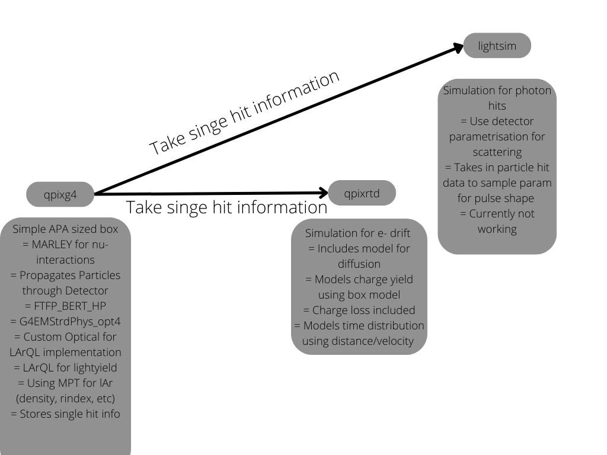

# Q-Pix Workflow

### Overview

We have a mutli-step workflow, where each part takes care of different physics/simulation steps. This is the bare workflow without the light propagation in Geant4.

1. MARLEY as a neutrino event interaction generator in Ar
2. Geant4 to take the resulting final state particles from MARLEY an simulate their propagation through the simulated detector (box). This does
3. qpixrtd generates the RTD's and tries to take the physics of electron propagation in to account.
4. Optionally: Patrick's semi-analytical model with a wrong parametrisation to convert the hits in the detector to light readout at the SiPMs.

## Geant4

MARLEY and Geant4 are combined together such that calling the G4 simulation call's MARLEY for every event as a particle generator. This can be disabled for particle gun studies.
The native QPix G4 code does not take in to account anything like Scintillation, Cerenkov or Recombination Effects.
It is a bare-bones G4 simulation in an APA-sized boxed filled with lAr and no other geometries (wires etc) are taken account of.

It produces a ROOT file filled with the (x,y,z,t) positions of every particle generated inside the lAr block. Further it saves the full step information (process, parent-particle etc.)
The physics lists used are

- `FTFP_BERT_HP`
- `G4EmStandardPhysics_option4`

When moving to my implementation, I added a material properties table to the lAr to allow for light production and added a custom Scintillation class, to use the LArQL model to predict the number of photons produced in each step. This extends the physics list to

- `FTFP_BERT_HP`
- `G4EmStandardPhysics_option4`
- `QPix_OpticalPhysics`

In side this Optical Physics class the mayor change towards the basic G4OpticalPhysics is the calling for [LArQL](https://arxiv.org/abs/2202.08905v2)[^1] to predict the number of generated photons in each step. These photons are then propagated through the detector, and their (x,y,z,t) position when leaving the lAr box stored. Not all step-info is saved.

## qpix RTD

The overall methodology for the code is to track the individual electrons. The code is setup to take the Geant4 truth information and produce "real electrons". Such electrons are then diffused in X, Y, and T. After being diffused they are grouped by pixel id then sorted by time. This produces the "pixel_info" object. This object can then look at electrons over time for a single pixel, and as such is used to make the reset. the reset is made by continuously adding the charge to a counter and checking when the threshold is crossed. once the threshold is reached the info is saved then the object is written into the root file.

For this some parameters for drift-velocity, diffusion, dead time, charge loss and recombination are used

```cpp
    // setup the default Qpix paramaters
    void set_Qpix_Paramaters(Qpix_Paramaters * Qpix_params)
    {
        Qpix_params->Wvalue = 23.6; // in eV
        Qpix_params->E_vel = 164800.0; // cm/s
        Qpix_params->DiffusionL = 6.8223  ;  //cm**2/s
        Qpix_params->DiffusionT = 13.1586 ; //cm**2/s
        Qpix_params->Life_Time = 0.1; // in s

        // Read out plane size in cm
        Qpix_params->Readout_Dim = 100;
        Qpix_params->Pix_Size = 0.4;

        // Number of electrons for reset
        Qpix_params->Reset = 6250;
        // time in ns

        Qpix_params->Sample_time = 10e-9; // in s
        Qpix_params->Buffer_time = 1; // in s
        Qpix_params->Dead_time = 0; // in s
        Qpix_params->Charge_loss = false;
        Qpix_params->Recombination = true;
    }//set_Qpix_Paramaters

```

For the recombination they use a [modified box model](https://arxiv.org/pdf/1306.1712.pdf)[^2] to predict the number of electrons produced per hit.
They then loop through all the electrons, distributes them randomly along the step and then samples a normal distribution for the x and y coordinate to simulate the diffusion.
The (x,y) projection of the resulting coordinates are taken, to determine the pixel that the electron will hit.
Its arrival time is determined by `(electron_z/E_vel)`.
If this is larger then a random sample of a life time pdf, the electron is ignored.

After all electrons found their corresponding pixels, the RTDs are calculated and the information stored.

## Light Simulation

For the analytical model we take the Geant4 Output without the light info, loop over all energy deposits in the file, calculate the number of photons produced using LArQL, sample a time distribution, angle distribution and calculates the relative solid angle of each PMTs/SiPM to predict the amount and timing of the photons in each SiPM.
Currently not working properly.
This is thought as an alternative to the G4 light propagation to save time.


## Summary



### Steps/Issues/Current Status

- GPU implementation
- Probably move to the same recombination model for all codes
- Build parametrisation for different sized detectors

[^1]:
[https://arxiv.org/abs/2202.08905v2](https://arxiv.org/abs/2202.08905v2)
[^2]:
[https://arxiv.org/pdf/1306.1712.pdf](https://arxiv.org/pdf/1306.1712.pdf)
